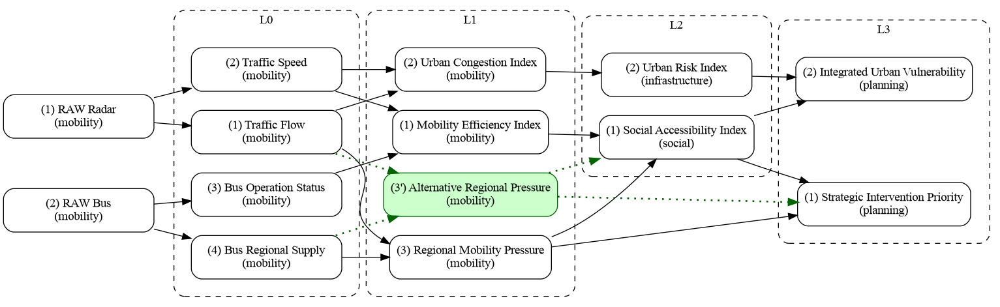

# Service Composition

Service Composition is an urban analytics project with MQTT data producers (C++), a Mosquitto broker, and AI/ML inference services (Python) organized in composition levels (L0 to L3).

Everything is managed with Docker. If this example is deployed to OpenStack, the same workload can be managed by Zun.

## Scenario Illustration (`scenarios.dot`)

The project scenario is defined in [`scenarios.dot`](scenarios.dot) and rendered below as an image.



## Directory Overview

### Producers

- `producer/bus`: bus telemetry producer.
- `producer/radar`: radar telemetry producer.

### Services

- `services/L0`: base inference services from raw observations.
- `services/L1`: first-level composition services.
- `services/L2`: intermediate composition services.
- `services/L3`: strategic composition services.
- `services/ufcity_microservice_lib`: shared runtime, MQTT, and semantic utilities.

### Messaging Infrastructure

- `broker-mqtt/mosquitto`: Mosquitto configuration and runtime data.

## Running

```bash
git clone https://github.com/makleyston-ufc/service-composition.git
cd service-composition
docker compose up -d
```

Basic management commands:

- `docker compose ps`
- `docker compose logs -f <service>`
- `docker compose restart <service>`
- `docker compose stop <service>`
- `docker compose start <service>`
- `docker compose down`

To receive each service output, just subscribe to its output topic. See the table below for the output topics per service.

## Service Tree and Outputs

Examples below are illustrative and may vary by model and input payloads.

| Service | Output topic | Example output |
| --- | --- | --- |
| `services/L0/traffic-flow` | `service/mobility/inference/traffic-flow` | `{"sosa:resultTime":"2024-01-01T00:00:00Z","saref:hasResult":{"saref:hasValue":"medium","urn:ufcity:confidence":0.87},"urn:ufcity:payload":{"features":{"vehicle_count":42}}}` |
| `services/L0/traffic-speed` | `service/mobility/inference/traffic-speed` | `{"sosa:resultTime":"2024-01-01T00:00:00Z","saref:hasResult":{"saref:hasValue":"fast","urn:ufcity:confidence":0.81},"urn:ufcity:payload":{"features":{"avg_speed":38.2}}}` |
| `services/L0/bus-operation-status` | `service/mobility/inference/bus-operation-status` | `{"sosa:resultTime":"2024-01-01T00:00:00Z","saref:hasResult":{"saref:hasValue":"regular","urn:ufcity:confidence":0.79},"urn:ufcity:payload":{"line_id":"201"}}` |
| `services/L0/bus-regional-supply` | `service/mobility/inference/bus-regional-supply` | `{"sosa:resultTime":"2024-01-01T00:00:00Z","saref:hasResult":{"saref:hasValue":"high","urn:ufcity:confidence":0.83},"urn:ufcity:payload":{"region":"north"}}` |
| `services/L1/mobility-efficiency-index` | `service/mobility/inference/mobility-efficiency-index` | `{"sosa:resultTime":"2024-01-01T00:00:00Z","saref:hasResult":{"saref:hasValue":"moderate","urn:ufcity:confidence":0.76},"urn:ufcity:payload":{"index":55.4}}` |
| `services/L1/urban-congestion-index` | `service/mobility/inference/urban-congestion-index` | `{"sosa:resultTime":"2024-01-01T00:00:00Z","saref:hasResult":{"saref:hasValue":"high","urn:ufcity:confidence":0.74},"urn:ufcity:payload":{"index":72.1}}` |
| `services/L1/regional-mobility-pressure` | `service/mobility/inference/regional-mobility-pressure` | `{"sosa:resultTime":"2024-01-01T00:00:00Z","saref:hasResult":{"saref:hasValue":"high","urn:ufcity:confidence":0.85},"urn:ufcity:payload":{"pressure_index":82.3}}` |
| `services/L1/alternative-regional-pressure` | `service/mobility/inference/regional-mobility-pressure` | `{"sosa:resultTime":"2024-01-01T00:00:00Z","saref:hasResult":{"saref:hasValue":"medium","urn:ufcity:confidence":0.82},"urn:ufcity:payload":{"pressure_index":61.8}}` |
| `services/L2/social-accessibility-index` | `service/social/inference/social-accessibility-index` | `{"sosa:resultTime":"2024-01-01T00:00:00Z","saref:hasResult":{"saref:hasValue":"medium","urn:ufcity:confidence":0.71},"urn:ufcity:payload":{"index":49.7}}` |
| `services/L2/urban-risk-index` | `service/infrastructure/inference/urban-risk-index` | `{"sosa:resultTime":"2024-01-01T00:00:00Z","saref:hasResult":{"saref:hasValue":"low","urn:ufcity:confidence":0.77},"urn:ufcity:payload":{"index":34.9}}` |
| `services/L3/strategic-intervention-priority` | `service/planning/inference/strategic-intervention-priority` | `{"sosa:resultTime":"2024-01-01T00:00:00Z","saref:hasResult":{"saref:hasValue":"priority","urn:ufcity:confidence":0.69},"urn:ufcity:payload":{"priority_level":3}}` |
| `services/L3/integrated-urban-vulnerability` | `service/planning/inference/integrated-urban-vulnerability` | `{"sosa:resultTime":"2024-01-01T00:00:00Z","saref:hasResult":{"saref:hasValue":"medium","urn:ufcity:confidence":0.73},"urn:ufcity:payload":{"index":58.2}}` |

## Producers Tree

- `producer/bus`
- `producer/radar`

## Data Sources

The models were based on real-world data published at https://dados.pbh.gov.br/en/dataset/.

## Authors

### Ph.D. Danne Makleyston Gomes Pereira  
[](https://lattes.cnpq.br/2002489019346835)
[](https://orcid.org/0000-0002-8260-5382)

Federal Insitute of Ceará (IFCE)  


---

### Ph.D. Angelo Roncalli Alencar Brayner  
[](https://lattes.cnpq.br/3895469714548887)
[](https://orcid.org/0000-0001-9820-9133)

Federal University of Ceará (UFC)  
MDCC – Graduate Program in Computer Science